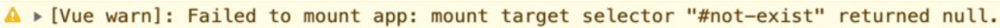

# 精读第2章 框架设计的核心要素

本文你将收获：

1. 知识点
> 框架设计的核心要素

2. 面试真题
> 说下 **Tree-Shaking** 的原理

## 为什么需要框架

1.  **提高开发效率：** 减少了重复的代码编写，提高了开发效率。
2.  **提供一致性和标准化：** 框架定义了一种结构和规范，使不同的开发团队能够在项目中使用相似的开发模式和最佳实践。
3.  **优化性能：** 框架通常会包括性能优化的功能，如虚拟DOM、懒加载、代码分割等，以确保应用程序在加载和运行时具有良好的性能。
4.  **提供跨浏览器兼容性：** 框架会处理浏览器兼容性问题，使开发者不必担心不同浏览器之间的差异。
5.  **支持大规模应用开发：** 前端框架通常设计用于构建大型、复杂的应用程序，提供了组织代码的方法，以便更好地管理和扩展大型代码库。
6.  **社区支持和生态系统：** 框架通常有庞大的社区支持和丰富的生态系统，包括插件、库和工具，可以帮助开发者解决各种问题和需求。
7.  **提高可维护性：** 使用框架的应用程序通常更容易维护，因为它们遵循一致的结构和最佳实践，降低了代码的混乱程度。

## 框架设计要考虑的问题

*   我们的框架应该给用户提供哪些**构建产物**？产物的模块格式如何？
*   当用户没有以预期的方式使用框架时，是否应该打印合适的警告信息从而提供更好的开发体验，让用户**快速定位问题**？
*   开发版本的构建和生产版本的构建有何区别？
*   **热更新**需要框架层面的支持，我们是否也应该考虑？
*   框架提供了多个功能，而用户只需要其中几个功能时，用户能否选择关闭其他功能从而**减少**最终资源的**打包体积**？

## 框架设计的核心要素

1.  提供友好的警告信息
2.  优秀的开发体验
3.  代码体积小
4.  构建产物支持多平台
5.  特性开关
6.  错误处理
7.  TS 支持

### 提供友好的警告信息

我们开发过程中在控制台常见的提示如下图所示：

好处

*   帮助用户快速定位问题
*   节省用户的时间
*   收获良好的口碑

### 优秀的开发体验

> 📌 开发小技巧：自动化格式 console 输出数据（浏览器允许我们编写自定义的 formatter，从而自定义输出形式）

我写了一段打印 vue 中的 ref 变量的代码

    

正常情况下 Console 里面会显示一下内容

但是这样的打印数据在调试过程中挺不友好的，如果我直接看到我声明的数值为0，会提高我的调试效率。接下来就讲一下小技巧

> 以 Chrome 为例，我们可以打开 DevTools 的设置，然后勾选“Console”→“Enable custom formatters”选项，如图所示

设置完成后再重新打印一遍，发现它如下图所示

这其实是 Vue 中的 initCustomFormatter 方法在起作用，具体源码就不展开讲了，有兴趣的可以去查相关代码

### 代码体积小

生产环境代码体积和开发环境代码体积构建时区别对待

*   生产环境不构建警告信息

*   Tree-Shaking

    *   Tree-Shaking 指的就是消除那些永远不会被执行的代码，也就是排除 dead code，现在无论是 rollup.js 还是 webpack，都支持 Tree-Shaking。
    *   想要实现 Tree-Shaking，必须满足一个条件，即模块必须是 ESM（ES Module），因为 Tree-Shaking 依赖 ESM 的静态结构。

### 构建产物支持多平台

满足Webpack、浏览器、Node.js服务端渲染等不同环境的需求

### 特性开关

*   对于用户关闭的特效，利用打包优化机制可以减少打包体积
*   为框架设计带来了灵活性，可以增加功能但是不担心包体积无止境的变大

### 错误处理

框架错误处理机制的好坏直接决定了用户应用程序的健壮性，还决定了用户开发时处理错误的心智负担。

### TS 支持

使用 TS 的好处有很多，如代码即文档、编辑器自动提示、一定程度上能够避免低级 bug、代码的可维护性更强等。

## 面试真题

> 说下 Tree-Shaking 的原理

### Tree-Shaking 是什么

Tree-Shaking 是一种基于 ES Module 规范的 Dead Code Elimination 技术，它的作用是剔除不被引用的代码，以减小最终打包文件的体积。它主要用于处理 ES6 模块系统（通常通过 `import` 和 `export` 语句来使用）。

### Tree-Shaking 的原理

1.  **静态分析**：编译工具（如Webpack、Rollup）首先会对整个代码进行静态分析，构建模块之间的依赖关系。
2.  **标记未引用代码**：对于每个模块，编译工具会标记所有未被导出或未被其他模块引用的变量、函数和类。这些标记的代码被认为是 "未引用代码"。
3.  **剔除未引用代码**：一旦所有模块都经过静态分析并且未引用的代码被标记，编译工具将删除这些未引用的代码，从而生成一个更小的输出文件。

### Tree-Shaking 使用注意事项

*   Tree-Shaking 只适用于 ES6 模块（import/export），不适用于 CommonJS 模块（require/module.exports）
*   为了使 Tree-Shaking 生效，通常需要使用生产模式构建工具，以便它能够进行代码优化
*   开发者可以通过在代码中使用 `import` 和 `export` 语句来帮助 Tree-Shaking 生效，以明确指定导出和引用的内容
*   使用第三方库时，确保这些库也支持 Tree-Shaking，否则可能会有未使用的代码被包含在最终的构建文件中
