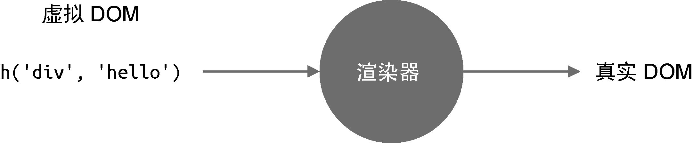
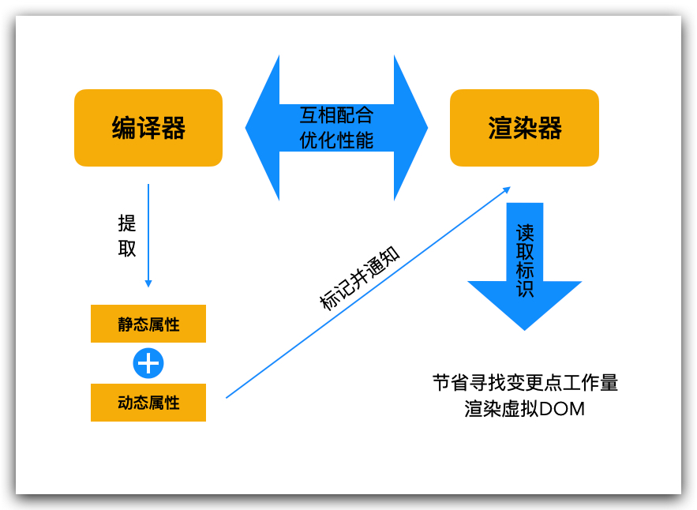

# 精读第3章 Vue.js 3 的设计思路

本文你将收获：

1. 知识点

> Vue.js 3 的设计思路和重要组成部分

2. 面试真题

> 讲讲 Vue 中渲染器和编译器的作用


## 如何设计一个声明式的 UI 框架

> 框架设计讲究全局视角的把控，一个项目就算再大，也是存在一条核心思路的，并围绕核心展开。

了解编写前端页面都涉及哪些内容

-   **DOM 元素**：例如是 div 标签还是 a 标签。
-   **属性**：如 a 标签的 href 属性，再如 id、class 等通用属性。
-   **事件**：如 click、keydown 等。
-   **元素的层级结构**：DOM 树的层级结构，既有子节点，又有父节点。

### Vue3 如何声明式地描述上述内容

-   使用与 HTML 标签一致的方式来描述 DOM 元素，例如描述一个 div 标签时可以使用 <div></div>；
-   使用与 HTML 标签一致的方式来描述属性，例如 <div id="app"></div>；
-   使用与 HTML 标签一致的方式来描述层级结构，例如一个具有 span 子节点的 div 标签 <div><span></span></div>。
-   使用 `:` 或 `v-bind` 来描述动态绑定的属性，例如 <div :id="dynamicId"></div>；
-   使用 `@` 或 `v-on` 来描述事件，例如点击事件 <div @click="handler"></div>；

### 渲染器 - 渲染虚拟DOM到浏览器页面

Vue 将 UI 声明式的描述出来后会转换成虚拟DOM，虚拟DOM的原理这里暂时不讲，下次会专门讲的。

> 📌 渲染器的作用：就是把虚拟 DOM 渲染为真实 DOM。精髓在于后续的更新，它会通过 Diff 算法找出变更点，并且只会更新需要更新的内容。




**渲染器实现思路：**

1.  **创建元素**：把 vnode.tag 作为标签名称来创建 DOM 元素
1.  **为元素添加属性和事件**：遍历 vnode.props 对象，如果 key 以 on 字符开头，说明它是一个事件，把字符 on 截取掉后再调用 toLowerCase 函数将事件名称小写化，最终得到合法的事件名称，例如 onClick 会变成 click，最后调用 addEventListener 绑定事件处理函数
1.  **处理 children**：如果 children 是一个数组，就递归地调用 renderer 继续渲染，注意，此时我们要把刚刚创建的元素作为挂载点（父节点）；如果 children 是字符串，则使用 createTextNode 函数创建一个文本节点，并将其添加到新创建的元素内

### 编译器 - 将模板编译为渲染函数

> 📌 编译器的作用：编译模板 → 生成渲染函数

如下是一个模板代码片段

```html
<div @click="handler">
   点击我！
</div>
```

 经过编译器后，会变成如下渲染函数

```javascript
render() {
    return h('div', { onClick: handler }, '点击我！')
}
```

## 编译器和渲染器如何配合工作

> 📌 编译器、渲染器都是 Vue.js 的核心组成部分，它们共同构成一个有机的整体，不同模块之间互相配合，进一步提升框架性能.


编译器和渲染器之间是存在信息交流的，它们互相配合使得性能进一步提升，而它们之间交流的媒介就是虚拟 DOM 对象。




### 举例说明

假设有如下模板

```html
<div id="foo" :class="cls"></div>
```

编译器会把这段代码编译成渲染函数

```javascript
render() {
  // 为了效果更加直观，这里没有使用 h 函数，而是直接采用了虚拟 DOM 对象
  // 下面的代码等价于：
  // return h('div', { id: 'foo', class: cls })
  return {
    tag: 'div',
    props: {
      id: 'foo',
      class: cls
    }
  }
}
```

在这段代码中，cls 是一个变量，它可能会发生变化。我们知道渲染器的作用之一就是寻找并且只更新变化的内容，所以当变量 cls 的值发生变化时，渲染器会自行寻找变更点。对于渲染器来说，这个“寻找”的过程需要花费一些力气。

编译器能识别出哪些是静态属性，哪些是动态属性，在生成代码的时候完全可以附带这些信息

```javascript
render() {
  return {
    tag: 'div',
    props: {
      id: 'foo',
      class: cls
    },
    patchFlags: 1 // 假设数字 1 代表 class 是动态的
  }
}
```

如上面的代码所示，在生成的虚拟 DOM 对象中多出了一个 patchFlags 属性，我们假设数字 1 代表“ class 是动态的”，这样渲染器看到这个标志时就知道：“哦，原来只有 class 属性会发生改变。”对于渲染器来说，就相当于省去了寻找变更点的工作量，性能自然就提升了。

## 面试真题

> 讲讲 Vue 中渲染器和编译器的作用

渲染器的作用：

- 负责将虚拟 DOM 渲染成实际的浏览器 DOM，使页面可见。

编译器的作用：

- 负责将组件模板编译成渲染函数，从而实现虚拟 DOM 的生成。

渲染器和编译器的关系：

- 它们协同工作以实现 Vue 的核心功能。编译器可以进行代码优化，例如静态节点提取、事件处理器的代码内联等。这些优化可以减少渲染函数的复杂性和运行时开销